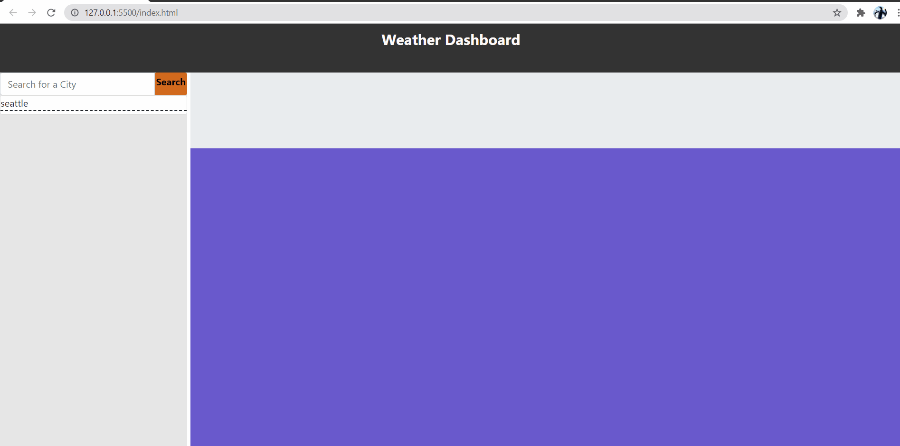

# Weather Dashboard

# Overview

    I was tasked with creating an application to forecast weather and show current weather.

    When the user inputs a city, the text value is passed into the api call and then it is called.
    The data is returned and then put into elements dynamically.

    Simultaniously, when the user clicks search the text value is added to a list.
    The city list is also clickable and can display city weather.

    A second API is used to give a 5 day forecast.
    The forecast is displayed at the time of the search click.

 

# Installation

    github deployed link: https://chickey49.github.io/Cams-HW6/
    github repo link: https://github.com/Chickey49/Cams-HW6

# Licensing

    Open source.

